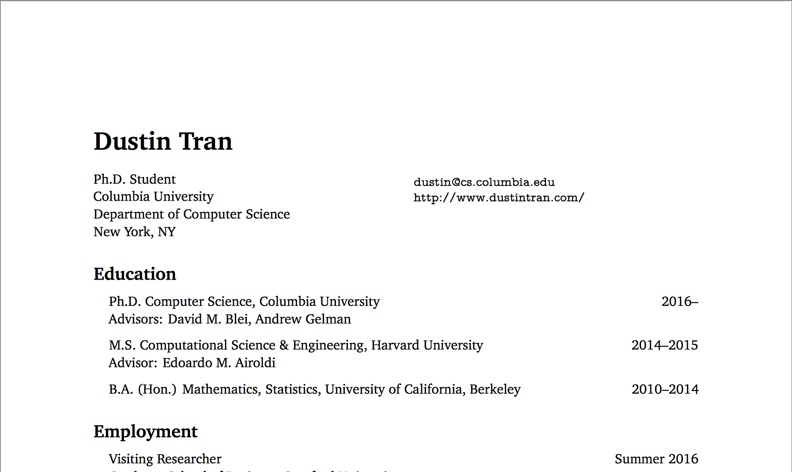
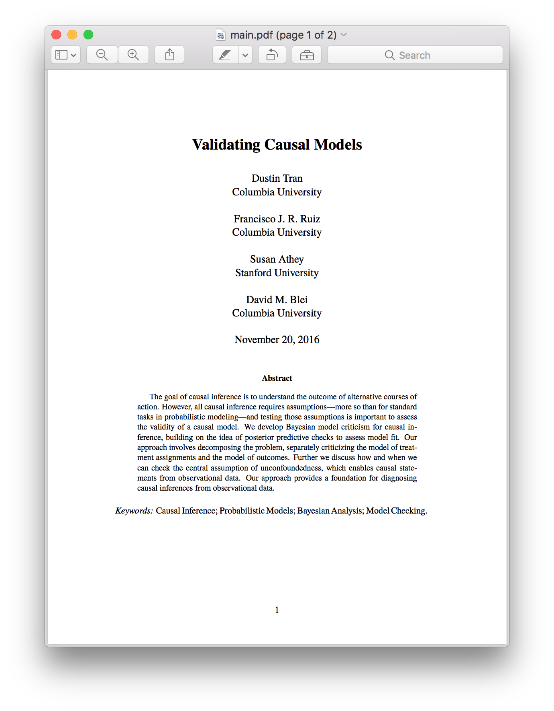
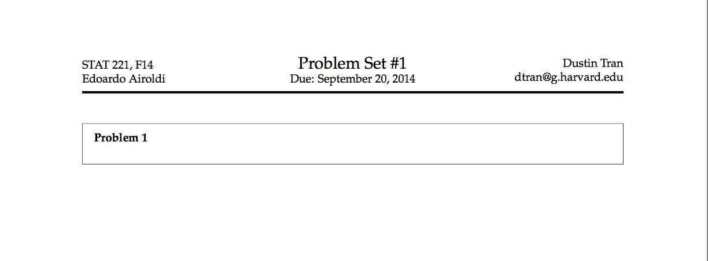
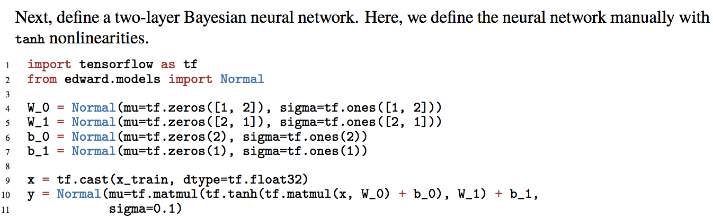
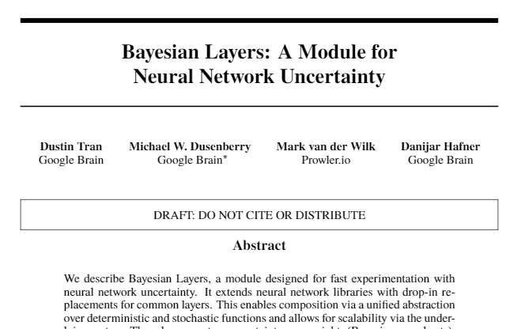

# LaTeX

When writing a new document, I begin from one of these templates. I
have found these fundamental to my workflow.

## Setup

Your preferences may vary.

Use [`latexmk`](https://www.ctan.org/pkg/latexmk/?lang=en). It's
powerful. My day-to-day use is: 1. write text in Vim; 2. run `latexmk -C`
and `latexmk -pdf main` in the terminal; 3. ??? profit.

In terms of packages:

+ I use MacTeX.
+ I use additional LaTeX packages listed
  [here](https://github.com/dustinvtran/dotfiles/tree/laptop-mac/Library/texmf/tex/latex).
+ I use mtpro2 as a default font. It is proprietary and requires
  manual installation.

## Curriculum Vitae

## Papers

## Lectures

## Problem Sets

## Other Examples

I use the `minted` package for code snippets.

I'm a big fan of a custom `\draftdisclaimer` command when distributing
paper drafts to colleagues. See `papers/preamble/preamble.tex` for its
code.

Style nits:

+ Don't write the extension to filenames. It's unnecessarily explicit
  and less readable: use
  `\input{preamble}` instead of
  `\input{preamble.tex}`, and
  `\includegraphics{figures/edward_calibration}` instead of
  `\includegraphics{figures/edward_calibration.pdf}`.
+ Use PDF-rendered figures, not PNG, so that the text scales with the
  paper format. You can even go a step further with TiKZ to make plots
  in LaTeX.
+ Use author names in your citation style, not numbers: `(MacKay,
  1992)` instead of `[12]`. Numbers save space but make it impossible
  to know what the citation is without tediously crawling
  back-and-forth. With author names, the citation is part of the
  sentence, helping substantiate its statement:

  > Weakly informative priors such as the Cauchy are often preferred
  > for robustness as they concentrate less probability at the mean
  > thanks to heavier tails (Gelman et al., 2006).
+ For notation, take advantage of
  [_emphasis_](https://en.wikipedia.org/wiki/Emphasis_(typography)),
  not just Greek alphabet for extra symbols. For example, plain can
  represent a scalar and boldface (`\mathbf`) can represent a matrix
  or vector. I often leave capital letters to represent the event
  space such as `a\in A` or constants: number of datapoints `N`.

I made a
[rant on Twitter in May 2021](https://twitter.com/dustinvtran/status/1398129705660805121).
Other nits and style tips are noted there.
