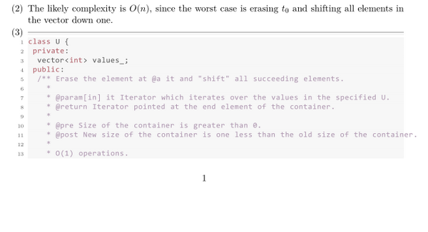

# LaTeX templates

Here are all templates I personally use for any LaTeX-specific task.

## Directory

Use `latexmk`. It's powerful. My day-to-day use is just with
`latexmk -C` and `latexmk -pdf main`.

### Curriculum Vitae
+ `cv.tex`: The general structure I use for my CV.

### Lecture Notes
+ `lecture.cls`: The document class declaring packages, formatting, and macros.
+ `main.tex`: A template for the master document used in compiling the
  collection of lecture notes.
+ `main_X.tex`: A template for individual lectures. `X` is `01`, `02`,
  ..., `99` corresponding to the lecture number.

### Papers
+ `jmlr2e.sty`: The document class declaring packages, formatting, and macros,
  taken from [JMLR](http://www.jmlr.org/author-info.html#Submission).
+ `bib.bib`: The bibliography.
+ `main.tex`: A general-purpose template, e.g., for personal notes and
  unstylized conference or journal papers.

### Problem Sets
+ `pset.cls`: The document class declaring packages, formatting, and macros.
+ `main_X.tex`: A template for documents which lay out answers to a
  list of exercises. `X` is `01`, `02`, ..., `99` corresponding to the
  problem set number.

## Examples
Here is an example of my lecture notes.

I use the `listings` package to produce my verbatim environment. Here is an
example of what my settings compile to:

