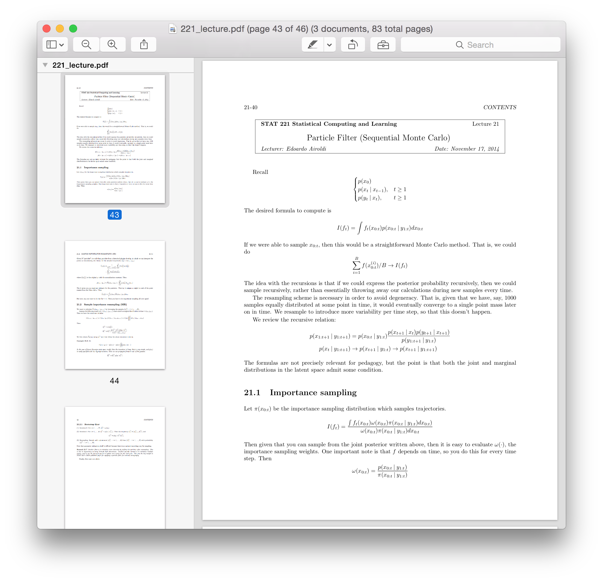

# LaTeX templates

This repository stores all LaTeX templates I personally use in producing
typewritten documents for research, courses, and miscellanea.

## Examples
Here is an example of my lecture notes.

I use the `listings` package to produce my verbatim environment. Here is an
example of what my settings compile to:

## Directory

### Lecture Notes
* `lecture.cls`: The document class declaring packages, formatting, and macros.
* `X_lecture.tex`: A template for the master document used in compiling the
  collection of lecture notes.
* `X_lecture_X.tex`: A template for individual lectures.

### Problem Sets
* `pset.cls`: The document class declaring packages, formatting, and macros.
* `X_psX.tex`: A template for documents which lay out answers to a list of exercises.

### Research Papers
* `jmlr2e.sty`: The document class declaring packages, formatting, and macros,
  taken from [JMLR](http://www.jmlr.org/author-info.html#Submission).
* `tran15.bib`: The bibliography.
* `tran15a.tex`: A template for personal notes, course project write-ups, and
  unstylized conference or journal papers.
